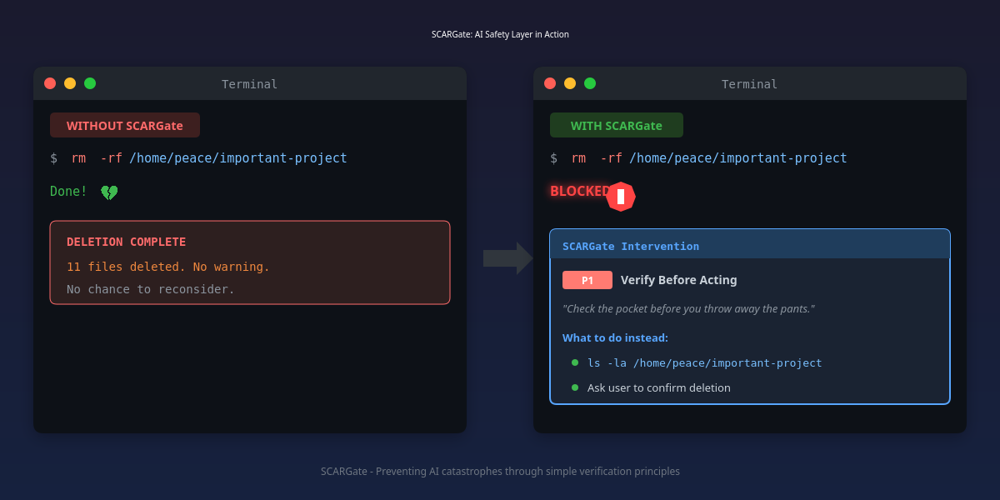

# SCARGate

[](https://github.com/Peace-png/SCARGate/stargazers)
[](LICENSE)
[](https://claude.ai/code)
[](https://bun.sh)
[](https://github.com/Peace-png/SCARGate#-for-non-coders-start-here)
[](https://github.com/Peace-png/SCARGate)

**The Guard at the Door** — principle-based AI action blocking.

## TL;DR

SCARGate stops your AI from making the same mistakes twice. It blocks dangerous actions before they happen and shows your AI what to do instead.

```
Without SCARGate:
  AI makes mistake → You notice → You fix it → AI forgets → Repeat

With SCARGate:
  AI about to make mistake → SCARGate blocks → Shows principle → AI corrects
```



---

## For Non-Coders (Start Here)

**You don't need to know how to code to use this.**

SCARGate was built by someone who can't verify code. Every feature exists because something actually went wrong.

### What SCARGate Does (Plain English)

Your AI assistant (Claude) can delete files, move things around, and push code to GitHub. Sometimes it gets confident and does things it shouldn't.

SCARGate is like a bouncer. Before Claude does anything risky, SCARGate checks:
- "Wait, does this break one of Peace's rules?"
- If yes → Block it, show the rule, suggest what to do instead
- If no → Let it through

### Why This Matters

If you're a non-coder using AI:
- You can't verify if the code works
- When AI says "it's done" — you have to trust it
- When something breaks — you don't know why
- You don't file bug reports. You just leave.

SCARGate is AI governance that doesn't require you to be technical. You write rules in plain English. The system enforces them.

---

### 🚀 Copy This Prompt (Give It To Your AI)

Don't know how to set this up? Copy everything below and paste it to your AI assistant (Claude, ChatGPT, etc.):

```
I want to set up SCARGate - an AI safety plugin that blocks dangerous actions.

My situation:
- I am NOT a coder - I cannot verify code or debug issues myself
- I need you to do the technical setup for me
- I need plain English explanations of what's happening
- I need you to check each step before moving on

Here's what I need you to do:

STEP 1 - Check Prerequisites
Run these commands and tell me the results:
- `bun --version` (need Bun runtime)
- `claude --version` (need Claude Code CLI)
If either is missing, install it for me or give me a link.

STEP 2 - Install SCARGate
Run: /plugin install https://github.com/Peace-png/SCARGate
Tell me if it worked. If it failed, fix it.

STEP 3 - Start the Daemon
SCARGate has a background process that watches for dangerous actions.
Run: cd ~/.claude/PAI/SCAR && bun scar-daemon.ts start
This should start a server on port 3773.
If this fails, tell me exactly what went wrong in plain English.

STEP 4 - Create My Rules File
Create a file at ~/.claude/PAI/USER/TELOS/WISDOM.md with my first principle.
Use this template - fill in something relevant to MY work:

### P1: [What I Want To Prevent]

**RULE:** [The rule in plain English]

**WHY:** [Why this matters to me]

**CONSEQUENCE LEVEL:** High

**CONSTRAINTS:**
1. [What to check before doing this action]
2. [Another safety check]

**Remember:**
> "[A memorable phrase]"

STEP 5 - Test It
Try to do something that should be blocked (like asking me to delete a folder).
If it gets blocked, tell me: "SCARGate is working. Your AI is now protected."
If it doesn't get blocked, debug it for me.

STEP 6 - Auto-Start (Optional but Recommended)
Set up SCARGate to start automatically when I log in:
- Copy the service file: `cp systemd/scar-daemon.service ~/.config/systemd/user/`
- Edit paths if my username isn't "peace"
- Run: `systemctl --user enable --now scar-daemon.service`
- Verify: `curl http://localhost:3773/health`
Tell me: "SCARGate will now start automatically on login."

IMPORTANT:
- Do NOT skip steps
- Do NOT assume something worked - verify each step
- If you get stuck, explain the problem in plain English
- Save a SETUP_LOG.txt file so we remember what was done
```

---

### One-Command Install (If You Know What You're Doing)

Open Claude Code and type:

```
/plugin install https://github.com/Peace-png/SCARGate
```

Then start the daemon:

```bash
cd ~/.claude/PAI/SCAR && bun scar-daemon.ts start &
```

### Your First Principle

Edit `principles/SOUL.md` and add a rule like this:

```markdown
### P1: Always Ask Before Deleting

**RULE:** Never delete files without showing me what's inside first.

**WHY:** I lost work because AI deleted a folder it thought was empty.

**CONSEQUENCE LEVEL:** High

**CONSTRAINTS:**
1. Show folder contents before any delete
2. Ask me to confirm

**Remember:**
> "Check the pocket before you throw away the pants."
```

Now your AI can't delete anything without checking first.

### If Something Goes Wrong

Just say: *"Look in my SCARGate folder and help me fix it."*

Claude will help you diagnose the issue.

---

## How It Works

1. **You write principles** — Rules in plain English about what your AI should/shouldn't do
2. **SCARGate installs automatically** — Hooks into your Claude Code session
3. **Protected** — When AI tries something risky, SCARGate checks against your principles

### What Gets Blocked

| Your Action | SCARGate Behavior |
|-------------|-------------------|
| Reading files | ✅ Always allowed |
| Searching | ✅ Always allowed |
| `ls`, `cat`, `git status` | ✅ Always allowed |
| Deleting files | 🛔 Blocked if matches principle |
| Moving/renaming | 🛔 Blocked if matches principle |
| Push to GitHub | 🛔 Blocked if matches principle |

SCARGate blocks when:
- The action matches one of your principles (80%+ relevance)
- The principle is marked "High" or "Critical" consequence
- The principle has specific checks to follow

### Read-Only Protection

SCARGate never blocks information gathering. It only blocks *destructive* actions. You can always read, search, and explore — the protection kicks in when something is about to change or be deleted.

---

## Auto-Start on Login (Linux)

The SCAR daemon can start automatically when you log in using systemd.

### Quick Setup

```bash
# Copy the service file
mkdir -p ~/.config/systemd/user/
cp systemd/scar-daemon.service ~/.config/systemd/user/

# Edit paths if needed (if your username isn't "peace")
nano ~/.config/systemd/user/scar-daemon.service

# Enable and start
systemctl --user daemon-reload
systemctl --user enable scar-daemon.service
systemctl --user start scar-daemon.service

# Verify it's running
curl http://localhost:3773/health
```

### What This Does

- **Auto-starts** when you log in
- **Restarts automatically** if it crashes
- **Logs to journal** — view with `journalctl --user -u scar-daemon`
- **Stops cleanly** when you log out

### Check Status

```bash
systemctl --user status scar-daemon
```

---

## Principle Format

```markdown
### P{number}: {Name}

**RULE:** What the principle requires

**WHY:** Why this matters (the origin story)

**CONSEQUENCE LEVEL:** Critical | High | Medium | Low

**YIN — What I did:**
The mistake that led to this principle

**YANG — What that caused:**
What went wrong because of that mistake

**CONSTRAINTS:**
1. First check to perform
2. Second check to perform
3. Third check to perform

**Remember:**
> A memorable phrase that captures the essence
```

**Levels:**
- **Critical/High** → Blocks the action
- **Medium/Low** → Advises but doesn't block

---

## Example Principles

The repo includes 14 real principles from production use:

| Principle | What It Stops |
|-----------|---------------|
| P1: Verify Before Acting | Deleting without checking |
| P5: Substrate Reality | Hallucinating content that doesn't exist |
| P7: Error Ownership | Defending mistakes instead of owning them |
| P11: Silent Churn | Losing non-coder users silently |

See `principles/WISDOM.md` for the full set.

---

## For Developers

### Install

```bash
/plugin install https://github.com/Peace-png/SCARGate
```

### Dev Setup

```bash
git clone https://github.com/Peace-png/SCARGate.git
cd SCARGate
bun install
```

Run the daemon:
```bash
bun scar-daemon.ts start
```

Test a match:
```bash
bun scar-daemon.ts match "delete this folder"
```

### Repository Structure

| File | Purpose |
|------|---------|
| `plugin.json` | Plugin manifest for Claude Code |
| `scar-daemon.ts` | Principle matching engine |
| `hooks/SCARGate.hook.ts` | The guard - blocks tool calls |
| `principles/WISDOM.md` | Example principles (14 real ones) |
| `docs/STACK.md` | System architecture |

---

## Why "SCAR"?

SCAR = **S**elf-**C**orrecting **A**rchitecture for **R**eliability

Also: Scars are how we remember wounds. Every principle in this system exists because something actually went wrong. These aren't theoretical rules — they're lessons encoded as protection.

---

## Philosophy

> "The first lie is a mistake. The second lie is a choice. When caught, collapse immediately—do not build a wall around the error."

SCARGate exists because:
- AI systems repeat mistakes
- Non-coders can't verify code
- Principles work better when enforced, not just displayed
- No-code AI governance shouldn't require technical knowledge

---

## Who This Is For

- **Non-coders using AI** — You want protection without needing to understand code
- **AI governance** — You need principled AI behavior, not just prompts
- **No-code workflows** — You work with AI but don't write software

This combination — **non-coder + no-code + ai-governance** — doesn't exist anywhere else.

---

## Contributing

- Issues and PRs welcome
- Tag small tasks with `good first issue`
- Non-coder contributions especially valued — if something is confusing, that's a bug

---

## License

MIT — see [LICENSE](LICENSE)

---

## Credits

Built from the Keystone Personal AI Infrastructure project.

The principles in `principles/WISDOM.md` were learned the hard way—by making mistakes and documenting them.
